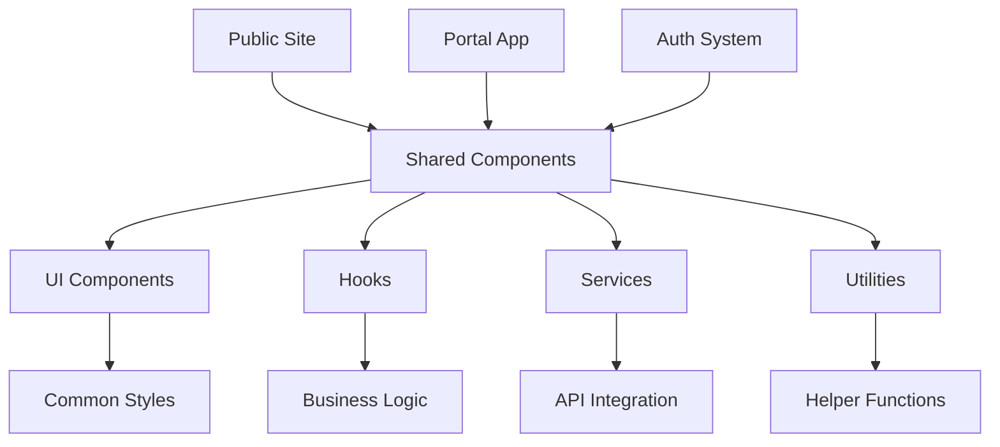

# Shared Component Library

> Reusable components, hooks, services, and utilities used across the Web3 Diagnostics platform

## Table of Contents

- [Overview](#overview)
- [Architecture](#architecture)
- [Directory Structure](#directory-structure)
- [Quick Start](#quick-start)
- [Component Library](#component-library)
- [Custom Hooks](#custom-hooks)
- [Shared Services](#shared-services)
- [Utilities](#utilities)
- [TypeScript Integration](#typescript-integration)
- [Development Guidelines](#development-guidelines)
- [Related Documentation](#related-documentation)

## Overview

The Shared library provides a centralized collection of reusable components and utilities that ensure consistency across the Web3 Diagnostics platform. This library serves as the **foundation layer** for all applications (public site, portal, auth).

### Key Benefits

- **Consistency** - Uniform UI/UX across all applications
- **Efficiency** - Reduce code duplication and development time
- **Maintainability** - Single source of truth for common functionality
- **Type Safety** - Comprehensive TypeScript support
- **Performance** - Optimized components with best practices

## Architecture



### Design Principles

1. **Modular Design** - Each component is self-contained
2. **Composability** - Components work together seamlessly
3. **Accessibility** - WCAG 2.1 compliance by default
4. **Performance** - Optimized for bundle size and runtime
5. **Developer Experience** - Clear APIs and comprehensive documentation

## Directory Structure

```
shared/
├── components/            # Reusable UI components
│   ├── common/           # Common component utilities
│   │   ├── BrandElements/ # Brand-specific components
│   │   └── Logo/         # Logo component variations
│   └── ui/               # Core UI component library
│       ├── Button/       # Button component system
│       ├── Checkbox/     # Checkbox input component
│       ├── Dialog/       # Modal dialog component
│       ├── Form/         # Form components and utilities
│       ├── Input/        # Input field components
│       ├── Label/        # Label component
│       ├── Modal/        # Modal overlay component
│       ├── Select/       # Select dropdown component
│       ├── button.tsx    # Button TypeScript component
│       ├── checkbox.tsx  # Checkbox TypeScript component
│       ├── dialog.tsx    # Dialog TypeScript component
│       ├── input.tsx     # Input TypeScript component
│       ├── label.tsx     # Label TypeScript component
│       └── select.tsx    # Select TypeScript component
├── hooks/                # Custom React hooks
│   └── use-toast.ts      # Toast notification hook
├── services/             # Shared business services
│   └── queryClient.ts    # React Query configuration
├── types/                # Shared TypeScript types
│   └── schema.ts         # Data schema definitions
└── utils/                # Utility functions
    ├── README.md         # Utility documentation
    └── script.js         # JavaScript utilities
```

## Quick Start

### Basic Component Usage

```javascript
// Import UI components
import { Button, Input, Modal } from '/src/shared/components/ui/'

// Import common components
import { Logo } from '/src/shared/components/common/Logo/'

// Import custom hooks
import { useToast } from '/src/shared/hooks/use-toast'

// Import utilities
import { formatDate } from '/src/shared/utils/script'
```

### TypeScript Components

```typescript
// Import TypeScript components
import { Button } from '/src/shared/components/ui/button'
import { Input } from '/src/shared/components/ui/input'
import type { ButtonProps } from '/src/shared/types/schema'
```

### Complete Example

```javascript
import { Button, Input, Modal } from '/src/shared/components/ui/'
import { useToast } from '/src/shared/hooks/use-toast'

function ExampleFeature() {
  const { showToast } = useToast()
  
  const handleSubmit = () => {
    showToast('Form submitted successfully!', 'success')
  }
  
  return (
    <div>
      <Input placeholder="Enter your email" />
      <Button onClick={handleSubmit}>
        Submit
      </Button>
    </div>
  )
}
```

## Component Library

### UI Components

#### 🔘 **Button Component**
```javascript
import { Button } from '/src/shared/components/ui/Button/'

// Basic usage
<Button>Click me</Button>

// With variants
<Button variant="primary">Primary Action</Button>
<Button variant="secondary">Secondary Action</Button>
<Button variant="outline">Outline Button</Button>

// With sizes
<Button size="sm">Small</Button>
<Button size="md">Medium</Button>
<Button size="lg">Large</Button>

// With loading state
<Button loading>Processing...</Button>
```

#### 📝 **Input Components**
```javascript
import { Input, Select, Checkbox } from '/src/shared/components/ui/'

// Text input
<Input 
  type="text" 
  placeholder="Enter text"
  value={value}
  onChange={handleChange}
/>

// Select dropdown
<Select 
  options={[
    { value: 'option1', label: 'Option 1' },
    { value: 'option2', label: 'Option 2' }
  ]}
  value={selected}
  onChange={handleSelect}
/>

// Checkbox
<Checkbox 
  checked={isChecked}
  onChange={handleCheck}
  label="Accept terms"
/>
```

#### 🎭 **Modal & Dialog**
```javascript
import { Modal, Dialog } from '/src/shared/components/ui/'

// Modal overlay
<Modal 
  isOpen={isModalOpen}
  onClose={closeModal}
  title="Modal Title"
>
  <p>Modal content goes here</p>
</Modal>

// Dialog component
<Dialog 
  trigger={<Button>Open Dialog</Button>}
  title="Confirmation"
  description="Are you sure you want to proceed?"
>
  <Button onClick={confirm}>Yes</Button>
  <Button onClick={cancel}>No</Button>
</Dialog>
```

### Common Components

#### 🏷️ **Brand Elements**
```javascript
import { Logo } from '/src/shared/components/common/Logo/'

// Logo variations
<Logo size="sm" />
<Logo size="md" />
<Logo size="lg" />
<Logo variant="light" />
<Logo variant="dark" />
```

## Custom Hooks

### useToast Hook

```typescript
import { useToast } from '/src/shared/hooks/use-toast'

function MyComponent() {
  const { toast } = useToast()
  
  const showSuccess = () => {
    toast({
      title: "Success!",
      description: "Operation completed successfully.",
      variant: "success"
    })
  }
  
  const showError = () => {
    toast({
      title: "Error",
      description: "Something went wrong.",
      variant: "destructive"
    })
  }
  
  return (
    <div>
      <Button onClick={showSuccess}>Show Success</Button>
      <Button onClick={showError}>Show Error</Button>
    </div>
  )
}
```

## Shared Services

### Query Client Configuration

```typescript
import { queryClient } from '/src/shared/services/queryClient'
import { QueryClient, QueryClientProvider } from '@tanstack/react-query'

// Use in your app
function App() {
  return (
    <QueryClientProvider client={queryClient}>
      <YourAppContent />
    </QueryClientProvider>
  )
}
```

### API Service Integration

```javascript
// Example service integration
import { customerApiService } from '/src/portal/shared/services/customerApiService'

class SharedDataService {
  static async fetchUserProfile(userId) {
    return await customerApiService.get(`/users/${userId}`)
  }
  
  static async updateUserProfile(userId, data) {
    return await customerApiService.put(`/users/${userId}`, data)
  }
}
```

## Utilities

### JavaScript Utilities

```javascript
import { 
  formatDate, 
  validateEmail, 
  generateId,
  debounce 
} from '/src/shared/utils/script'

// Date formatting
const formattedDate = formatDate(new Date(), 'MM/dd/yyyy')

// Email validation
const isValid = validateEmail('user@example.com')

// Generate unique ID
const uniqueId = generateId()

// Debounce function calls
const debouncedSearch = debounce(searchFunction, 300)
```

## TypeScript Integration

### Type Definitions

```typescript
// Import shared types
import type { 
  User, 
  ApiResponse, 
  ButtonProps,
  ModalProps 
} from '/src/shared/types/schema'

// Use in components
interface ComponentProps {
  user: User
  onUpdate: (user: User) => void
}

function UserProfile({ user, onUpdate }: ComponentProps) {
  // Component implementation
}
```

### Schema Validation

```typescript
import { userSchema, apiResponseSchema } from '/src/shared/types/schema'

// Validate data
const validatedUser = userSchema.parse(userData)
const validatedResponse = apiResponseSchema.parse(apiResponse)
```

## Development Guidelines

### 🎯 **Component Creation**

1. **Create Component Directory**
   ```bash
   mkdir -p shared/components/ui/NewComponent
   cd shared/components/ui/NewComponent
   ```

2. **Component Structure**
   ```
   NewComponent/
   ├── index.js          # Main component export
   ├── NewComponent.js   # Component implementation
   ├── NewComponent.css  # Component styles
   └── README.md         # Component documentation
   ```

3. **Component Template**
   ```javascript
   // NewComponent.js
   import './NewComponent.css'
   
   export function NewComponent({ 
     children, 
     variant = 'default',
     className = '',
     ...props 
   }) {
     return (
       <div 
         className={`new-component new-component--${variant} ${className}`}
         {...props}
       >
         {children}
       </div>
     )
   }
   ```

### 🔧 **TypeScript Components**

```typescript
// TypeScript component template
import type { ReactNode } from 'react'

interface NewComponentProps {
  children: ReactNode
  variant?: 'default' | 'primary' | 'secondary'
  className?: string
}

export function NewComponent({ 
  children, 
  variant = 'default',
  className = '',
  ...props 
}: NewComponentProps) {
  return (
    <div 
      className={`new-component new-component--${variant} ${className}`}
      {...props}
    >
      {children}
    </div>
  )
}
```

### 🎨 **Styling Guidelines**

```css
/* Component CSS structure */
.new-component {
  /* Base styles */
  display: block;
  position: relative;
  
  /* Use CSS custom properties */
  background-color: var(--component-bg);
  color: var(--component-text);
  border-radius: var(--radius-md);
  
  /* Responsive design */
  @media (max-width: 768px) {
    /* Mobile styles */
  }
}

/* Variants */
.new-component--primary {
  background-color: var(--brand-primary);
  color: var(--text-light);
}

.new-component--secondary {
  background-color: var(--brand-secondary);
  color: var(--text-light);
}

/* States */
.new-component:hover {
  transform: translateY(-2px);
  transition: transform 0.2s ease;
}

.new-component:disabled {
  opacity: 0.5;
  cursor: not-allowed;
}
```

### 📚 **Documentation Standards**

Each component should include:

1. **Purpose and usage**
2. **Props API documentation**
3. **Code examples**
4. **Accessibility notes**
5. **Related components**

### 🧪 **Testing Guidelines**

```javascript
// Component testing template
import { render, screen, fireEvent } from '@testing-library/react'
import { NewComponent } from './NewComponent'

describe('NewComponent', () => {
  test('renders children correctly', () => {
    render(<NewComponent>Test content</NewComponent>)
    expect(screen.getByText('Test content')).toBeInTheDocument()
  })
  
  test('applies variant classes', () => {
    render(<NewComponent variant="primary">Content</NewComponent>)
    expect(screen.getByText('Content')).toHaveClass('new-component--primary')
  })
  
  test('handles click events', () => {
    const handleClick = jest.fn()
    render(<NewComponent onClick={handleClick}>Click me</NewComponent>)
    fireEvent.click(screen.getByText('Click me'))
    expect(handleClick).toHaveBeenCalled()
  })
})
```

## Related Documentation

### 📚 **Component Documentation**

- [📖 UI Component Library](./components/ui/README.md)
- [📖 Common Components](./components/README.md)
- [📖 Brand Elements](./components/common/README.md)

### 🎨 **Design & Styling**

- [📖 CSS Architecture](../common/styles/README.md)
- [📖 Design Tokens](../common/styles/variables.css)
- [📖 Component Styling Guide](./components/ui/README.md#styling)

### 🛠️ **Development Resources**

- [📖 TypeScript Types](./types/README.md)
- [📖 Custom Hooks](./hooks/README.md)
- [📖 Utility Functions](./utils/README.md)

### 🔗 **Integration Guides**

- [📖 Portal Integration](../portal/README.md#shared-components)
- [📖 Public Site Integration](../public/README.md#component-usage)
- [📖 Auth Integration](../auth/README.md#ui-components)

---

**💡 Quick Tips**

- Always check if a component exists before creating a new one
- Use TypeScript versions for new components
- Follow the established naming conventions
- Include proper accessibility attributes
- Test components with different props and states

**🚀 Getting Started Checklist**

- [ ] Import components from `/src/shared/components/ui/`
- [ ] Use custom hooks for common functionality
- [ ] Apply consistent styling with CSS variables
- [ ] Include proper TypeScript types
- [ ] Test component integration with your feature

**🆘 Need Help?**

- Check component-specific documentation in each directory
- Review existing component implementations for patterns
- See [design system guide](./components/ui/README.md) for styling standards
- Reference [utility documentation](./utils/README.md) for helper functions